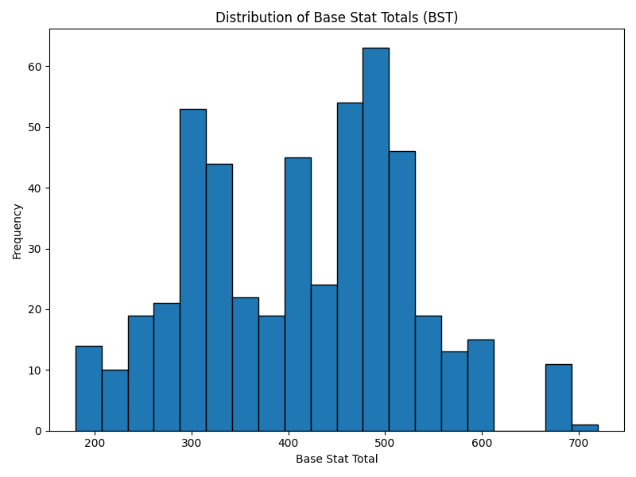
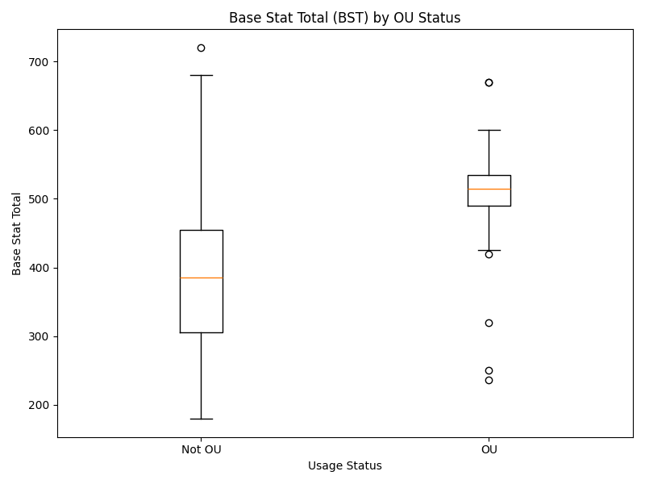
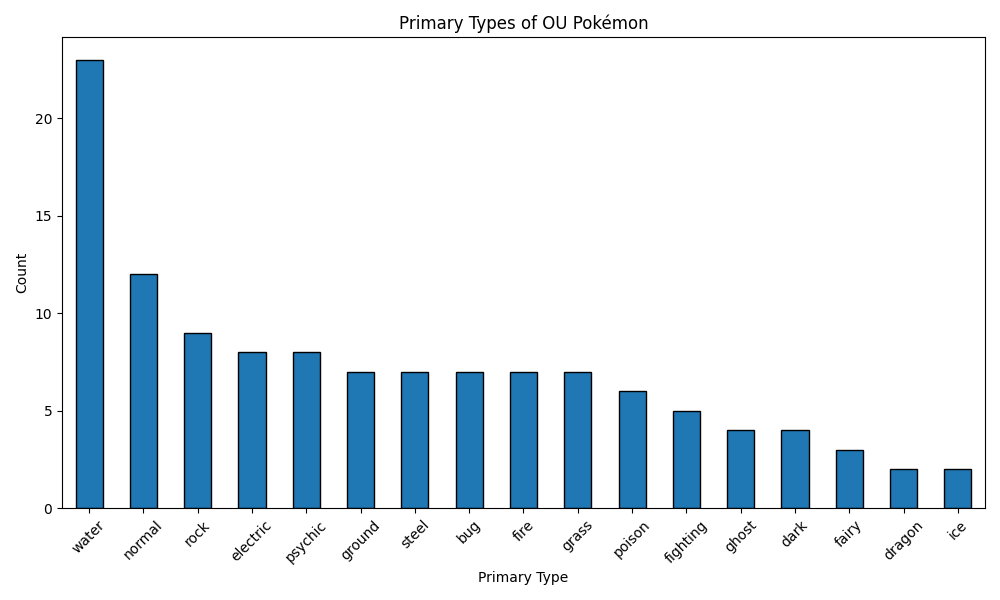

# Analyzing the Building Blocks of Competitive Pokémon Viability in Generation 4

## Introduction and Motivation
The realm of competitive Pokémon is a fascinating microcosm of strategic planning, resource management, and complex game theory. Unlike a traditional playthrough where simply picking your favorites might be enough to defeat the Elite Four, the competitive scene requires players to rigorously evaluate the statistical advantages, typings, movepools, and abilities of each creature. Generation 4 (Diamond, Pearl, and Platinum) represents a pivotal moment in the franchise's history. It introduced the physical/special split—a mechanic that revolutionized how attacks were calculated, fundamentally changing the viability of many existing and new Pokémon. This generation provides an excellent case study precisely because it established many of the foundational tactical concepts that define modern competitive play.

To keep the game balanced and enjoyable, the competitive community, primarily organized by **Smogon University**, implemented a tier system. This system organizes Pokémon based on their usage rates in competitive formats. The most prominent tier, OverUsed (OU), represents the central metagame, containing the strongest and most frequently utilized Pokémon. By analyzing the traits of Pokémon within this tier compared to those relegated to lower tiers, we can quantifiably determine what makes a Pokémon competitively viable. This tier system is not merely arbitrary; it is a direct reflection of performance optimization, making it an excellent target for data-driven analysis.

## Motivating Question
The core objective of this analysis is to answer:
**How do base stats and typing relate to competitive viability in the Gen 4 metagame?**

We want to understand to what extent raw numbers (Base Stat Totals) and defensive/offensive elemental typings correlate with a Pokémon achieving OverUsed (OU) status, and whether these readily accessible metrics are deterministic indicators of competitive success.

## Data Sources and Ethics
This project leverages two robust, publicly available data sources to piece together a comprehensive perspective on Pokémon viability:

1.  [**PokéAPI**](https://pokeapi.co/): A widely respected, open RESTful API that provides granular, encyclopedic baseline statistics for every Pokémon. We collected the fundamental data—Base Stats and Elemental Typings—from this source.
2.  [**Smogon Usage Stats**](https://www.smogon.com/stats/): Smogon generously publishes monthly JSON dumps detailing usage frequencies across their tier ladders. We used this data to define the "target variable" of our analysis (whether a Pokémon is OU or not).

**Ethical Considerations:** When interacting with community-hosted APIs like PokéAPI, it is crucial to respect their infrastructure. Our data collection scripts strictly implement rate-limiting via time delays specifically to avoid overwhelming their servers. Furthermore, all data utilized is completely objective, public game data involving no Personally Identifiable Information (PII) or sensitive material.

## Data Collection Overview
Building the analytical dataset involved a multi-step pipeline requiring careful merging of varied data structures:

*   **API Paging & Flattening:** We iterated through the first 493 National Pokédex entries via PokéAPI, flattening deeply nested JSON responses to extract raw attributes like HP, Attack, and typing arrays.
*   **Web Scraping & Parsing:** We programmatically scraped the latest available Gen 4 monthly folder from the Smogon Stats index, downloading the comprehensive JSON payload for each competitive tier (Ubers, OU, UU, NU).
*   **Data Normalization:** A major challenge was name discrepancy (e.g., "Mr. Mime" vs "mr-mime"). We applied a strict string normalization function (lowercasing, punctuation stripping) across both data sources to ensure alignment.
*   **Joining & Engineering:** With consistent keys, the datasets were left-joined. Missing usage values were imputed cleanly with 0.0 percentages. Finally, we engineered several critical evaluation fields, such as `bst` (Base Stat Total) and `is_ou` (a boolean indicating usage in the OU tier).

## Final Dataset Overview
The final output, `pokemon_gen4_competitive.csv`, encapsulates the entire Generation 4 ecosystem.

*   **Total Rows:** 493 (Every Pokémon from Bulbasaur to Arceus)
*   **Total Columns:** 25

**Brief Data Dictionary:**
*   `id` (Numeric): The National Pokédex number.
*   `name_key` (Categorical): The normalized identifier used for joining.
*   `type1` / `type2` (Categorical): Primary and secondary typings.
*   `hp`, `attack`, `defense`, `sp_attack`, `sp_defense`, `speed` (Numeric): Individual base statistics.
*   `bst` (Numeric): Engineered feature representing the sum of all individual core stats.
*   `usage_ou` (Numeric): The percentage usage rate of the Pokémon in the OU tier.
*   `is_ou` (Categorical/Boolean): Engineered 1/0 column denoting presence in standard play.
*   `formats_used_count` (Numeric): Number of tiers the Pokémon recorded any usage in.

The dataset contains a healthy mix of continuous variables (stats, usage percentages) and categorical/boolean variables (typings, tier classifications), allowing for diverse analytical cuts.

## Exploratory Observations

To begin unraveling our motivating question, we generated several visualizations.

**Observation 1:** The histogram of Base Stat Totals reveals a roughly bimodal distribution, rather than a perfect bell curve. We observe a large cluster around 400-500 BST, which represents the majority of fully evolved Pokémon, and a sharp spike exactly at the 600 mark. The 600 BST mark is famously reserved for "pseudo-legendary" or mythical tier Pokémon. This suggests the developers intentionally designed heavy concentrations at specific arbitrary power thresholds rather than perfectly smooth scaling.

**Observation 2:** The boxplot slicing BST by OU status decisively demonstrates that raw stats matter. The median BST for OU Pokémon is significantly higher than that of non-OU Pokémon. The entire interquartile range for the OU category sits comfortably above the 75th percentile of the non-OU category. However, the presence of long bottom whiskers and outliers in the OU category proves an important point: high stats are highly correlated with viability, but they are *not* strictly mandatory. Pokémon with lower BSTs can still achieve OU status.

**Observation 3:** Examining the primary typings of OU Pokémon highlights an uneven distribution. Steel, Water, and Dragon are heavily represented at the top of the metagame. Steel is widely regarded as the best defensive typing in the game due to its numerous resistances, which aligns perfectly with this high frequency in OU. Conversely, traditionally "fragile" or offensively narrow types like Bug or Poison struggle to break into the top tier. This suggests that excellent defensive typing can compensate for lower overall stats, and poor typing can doom otherwise statistically strong Pokémon.

## Data Quality Considerations
While this dataset is robust, drawing overly confident conclusions requires acknowledging several inherent biases and limitations:

1.  **Usage Does Not Perfectly Equal Strength:** A Pokémon might be heavily used simply because it is a fan favorite, or because it perfectly counters one specific overcentralizing threat, not because it is universally powerful.
2.  **Temporal Bias:** The Smogon usage data fluctuates month to month based on metagame trends. The data snapshot taken represents the metagame *at the time of scraping*, missing years of historical shifting viability.
3.  **Missing Hidden Variables:** Our stat dataset entirely ignores two of the most critical aspects of competitive Pokémon: Abilities and Movepools. A Pokémon with phenomenal stats is useless without good attacks, and a Pokémon with mediocre stats but an incredibly potent Ability (like Serene Grace or Intimidate) might dominate the tier.
4.  **Tier Availability:** Depending on the month scraped, specific lower tiers (like NU or PU) may not have crossed specific statistical confidence cutoffs to be generated by Smogon, meaning `0.0` could sometimes represent "unavailable data" rather than "true zero usage."

Awareness of these constraints prevents us from making absolute statements about a Pokémon's strict objective strength, limiting us to statements about its *practical viability in a specific context*.

## Reproducibility
The completely automated, end-to-end data pipeline is fully available on GitHub. Anyone can pull the raw data, perform the cleaning, and generate the CSV themselves using Python.

**GitHub Repository:** [PokeViability Repository](https://github.com/yourusername/PokeViability)

To reproduce this analysis locally, simply follow these steps:
1. Clone the repository listed above.
2. Install the lightweight dependencies with `pip install -r requirements.txt`.
3. Run the orchestration pipeline sequentially via `src/pull_pokeapi.py`, `src/scrape_smogon.py`, `src/merge_data.py`, and `src/clean_transform.py`.
4. Generate the charts with `src/generate_visuals.py`.
